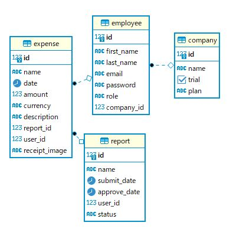

# Expense-Report-Demo
 
## What's this?
This is a web-based application intended to use in a demo of Pendo. It's a simple expense report app that has miniature functionalies of real one. The Pendo agent script is installed along with `header.html` in this package.

## How it works
There are 3 roles defined in this app and each role has their own UI for the following actions:
### User
Users can handle only expenses and reports that they created. They can't see others' expenses or reports.
* Create/modify/delete expenses
* Upload/delete an image of receipt to attach to an expense; an image file less than 2MB can be uploaded and pdf is not supported
* Create/modify/delete reports
* Add expenses to a report
* Submit a report for approval  
### Approver
Approvers can see only reports submitted by users who are in the same company. There is no functionality to add a reason of approval or rejection in the report.
* Approve/reject reports  
### Admin
Admins can create accounts only in their company. The first admin should be created by directly inserting a record in DB. 
* Create/modify/delete accounts (User/Approver/Admin)  

## How to set up in you environment
You need to install database and redis along with this app. You also need to make sure if your environment to run this app has Python packages described in requirement.txt. The following environment variables must be referred from os.environ in `expense_report_demo.py`:
* FLASK_SECRET_KEY: Arbitrary string
* DATABASE_SCHEMA: Schema of DB for this app
* DATABASE_URL: URL to access DB for this app
* PENDO_API_KEY: API key of Pendo; Navigate you to "Subscription Setting"->your app->"App Details"
* PENDO_TRACK_EVENT_SECRET_KEY: Key to give when throwing TrackEvent; In the same page where API key is shown
* REDIS_URL: URL to refer to Redis you install
  
Pendo setting:
* Set `app_language` to Language Preference Metadata in Localization Settings
  
This gives Pendo a value representing the language you are using with a pre-defined value in this app. Since the default metadata of Pendo, `language` is automatically set accorting to the browser setting, the format can be unpredictable for the app.

## Data model

## Localization
### Language support
Currently it supports Japanese and English. If you would like to add another language, please modify code as follows:  
**expense_report_demo.py**
* Add code to handle the new language(s) in `set_language()`
* Update a list `SUPPORT_LANGUAGES`
**json/messages_xx-XX.json**
* Add a new file `messages_xx-XX.json` referring to files of supported languages

### Currency expression
In case you woule like to use currency other than Yen and Dolloar, please modify code as follows:
**expense_report_demo.py**
* Add a new constant variable starting "CURRENCY_" followings variables `CURRENCY_DOLLAR` and `CURRENCY_YEN`
* Update a list `CURRENCIES`
* Update `get_default_currency()` and `generate_currency_expression`

### Full name expression
In case the language requires full name displayed in Last name and First name order like Japanese, please modify code as follows:
**expense_report_demo.py**
* Update `generate_fullname()`

## Pendo collaboration
This app gives the following IDs and metadata to Pendo:
**Visitor data**
* Visitor ID - `id`
* Role of the user - `role`
* Full name of the user - `full_name`
* Language used - `app_language`
  
(A key `language` is a reserved metadata that Pendo puts the language of the browser you are using)
  
**Account data**
* Account ID - `id`
* Company name - `name`
* Plan the company pays for - `plan`

**Track Events**
The following track events are thrown when an image file is uploaded or deleted:
* File Uploaded
* File Deleted